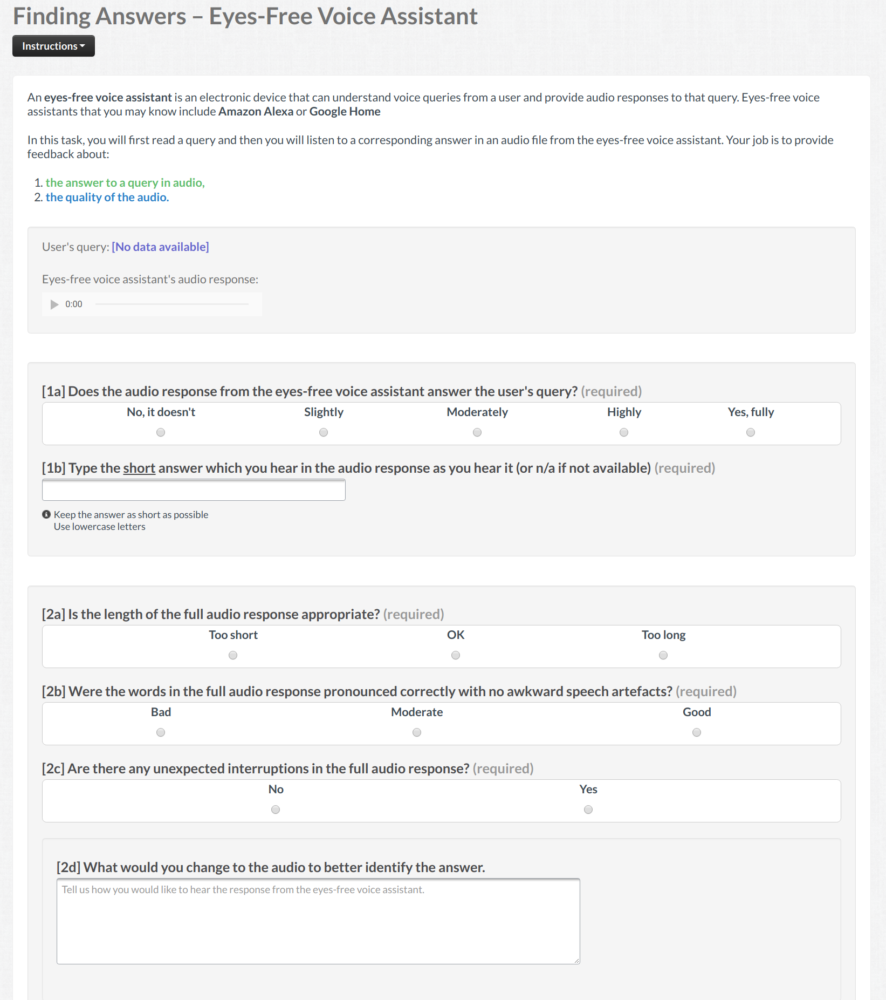

# clef2019-prosody
This repository contains the dataset release to accompany the CLEF 2019 paper titled

*"Using Audio Transformations to Improve Comprehension in Voice Question Answering"* by Aleksandr Chuklin, Aliaksei Severyn, Johanne R. Trippas, Enrique Alfonseca, Hanna Silen, and Damiano Spina.

Please, use the following citation

```bibtex
@inproceedings{clef2019prosody,
  title={{Using Audio Transformations to Improve Comprehension in Voice Question Answering}},
  author = {Aleksandr Chuklin and
            Aliaksei Severyn and
            Johanne R. Trippas and
            Enrique Alfonseca and
            Hanna Silen and
            Damiano Spina},
  booktitle={{Conference and Labs of the Evaluation Forum (CLEF)}},
  year={2019},
  location = {Lugano, Switzerland}
}
```

You may also refer to the extended version on ArXiv: https://arxiv.org/abs/1806.03957

## Example Audio

* Emphasis (Google TTS):
<audio controls="controls">
      <source src="media/Google_emphasis.mp3" type="audio/ogg"></source>
      <source src="{{mp3_url}}" type="audio/mpeg"></source>
      <!-- The next line will only be executed if the browser doesn't support the <audio> tag-->
    Your browser does not support the HTML5 Audio element or MP3 playback.
  </audio>

## Rating Interface for Crowd Workers

